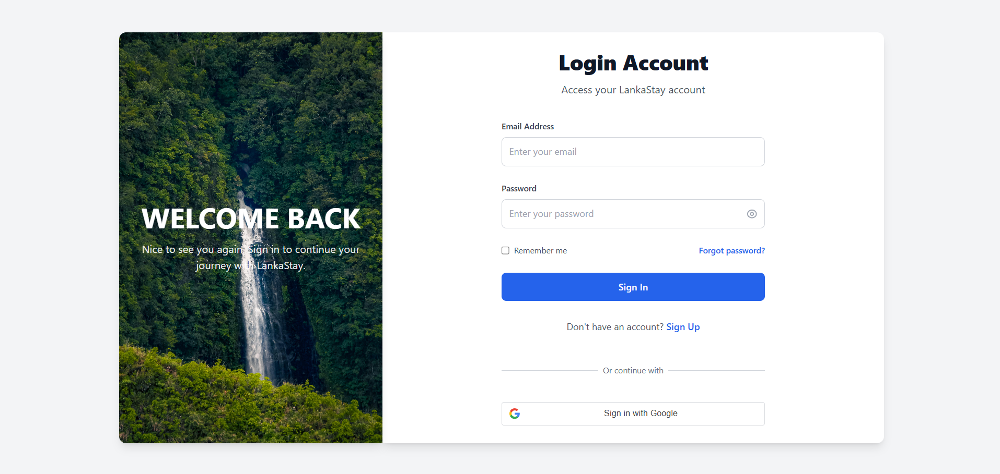
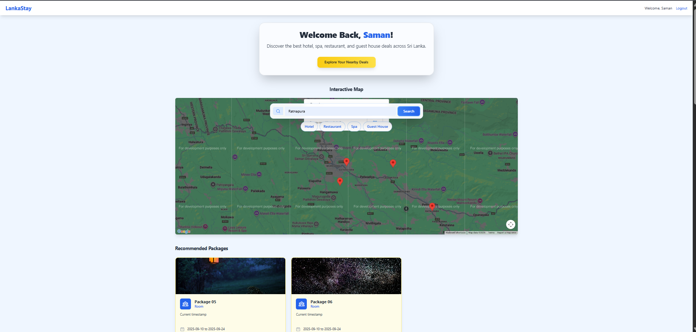
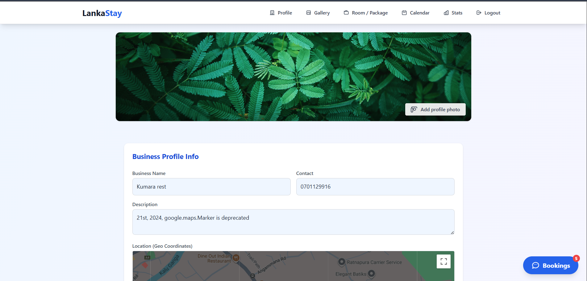
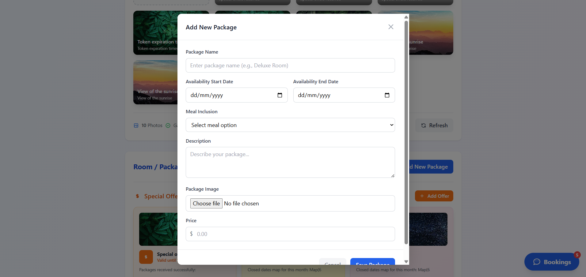

# LankaStay - Advanced API Development Final Project

This is the final project for the **Advanced API Development (ITS 1114)** module, part of the Higher Diploma in Software Engineering at the Institute of Software Engineering (IJSE).


| **Student Name** | [Visun prabodha] |
| **Batch Number** | [GDSE71] |


## 📋 Table of Contents

- [Project Overview](#-project-overview)
- [Key Features](#-key-features)
- [Technology Stack](#-technology-stack)
- [Architecture](#-architecture)
- [Screenshots](#-screenshots)
- [Setup and Installation Guide](#-setup-and-installation-guide)
- [YouTube Project Demo](#-youtube-project-demo)
- [API Endpoints](#-api-endpoints-documentation)

---

## 📖 Project Overview

LankaStay is a comprehensive hotel and package booking platform designed to connect tourists with business owners across Sri Lanka. The system features two main user roles: **Tourists**, who can search for, view, and book hotel packages, and **Business Owners**, who can manage their business profiles, packages, special offers, and bookings.

This project is built using a modern, layered architecture with a Spring Boot backend providing a secure RESTful API and a separate frontend for user interaction.

---

## ✨ Key Features

### For Tourists:
-   Secure user registration and JWT-based authentication.
-   Interactive map to explore hotels and packages based on location.
-   Search and filter functionalities for packages.
-   View detailed information about businesses and their offerings.
-   Book packages with a "Pending" status.
-   View personal booking history with statuses (Pending, Confirmed, Cancelled).

### For Business Owners:
-   Secure registration and JWT-based authentication.
-   Dashboard to manage business profile information (name, location, images, etc.).
-   CRUD (Create, Read, Update, Delete) functionality for hotel packages.
-   Functionality to manage special offers for a limited time.
-   View incoming booking requests from tourists.
-   Ability to **Confirm** or **Cancel** pending bookings.
-   Manage room availability through an interactive calendar.

---

## 🛠️ Technology Stack

### Backend:
-   **Framework:** Spring Boot 3.x
-   **Language:** Java 17
-   **Security:** Spring Security (JWT Authentication & Authorization)
-   **Database:** MySQL
-   **Data Access:** Spring Data JPA / Hibernate
-   **API:** RESTful APIs
-   **Build Tool:** Maven

### Frontend:
-   **Language:** HTML, CSS, JavaScript
-   **Framework/Library:** Tailwind CSS, jQuery, SweetAlert2
-   **Mapping:** Google Maps API

### Tools:
-   **IDE:** IntelliJ IDEA (Backend), VS Code (Frontend)
-   **API Testing:** Postman
-   **Database Management:** MySQL Workbench
-   **Version Control:** Git & GitHub

---

## 🏗️ Architecture

The application is designed using a **Layered Architecture** to ensure a clean separation of concerns.

1.  **Presentation Layer (Controller):** Handles all incoming HTTP requests, validates input (DTOs), and delegates tasks to the service layer.
2.  **Service Layer (Business Logic):** Contains the core business logic, transaction management, and coordinates operations between different repositories.
3.  **Persistence Layer (Repository):** Manages all database interactions using Spring Data JPA.
4.  **Domain Layer (Entity):** Represents the database tables as Java objects.

---

## 📸 Screenshots

*(Include clear screenshots of your application's key features here. Replace the placeholder images and descriptions.)*

**1. Login Page**


**2. Tourist Dashboard with Map**


**3. Business Owner Dashboard**


**4. Package Management Modal**


---

## 🚀 Setup and Installation Guide

Follow these steps to get the project up and running on your local machine.

### Prerequisites:
-   Java 17 or higher
-   Apache Maven 3.8 or higher
-   MySQL Server
-   Node.js (for frontend, if you use a package manager)
-   An IDE like IntelliJ IDEA or VS Code

### Backend Setup:
1.  **Clone the repository:**
    ```bash
    git clone (https://github.com/Visun517/lankaStay.git)
    ```
2.  **Navigate to the backend folder:**
    ```bash
    cd Back-end/
    ```
3.  **Configure the database:**
    -   Create a new MySQL database named `lankastay_db`.
    -   Open `src/main/resources/application.properties`.
    -   Update the `spring.datasource.username` and `spring.datasource.password` properties with your MySQL credentials.
4.  **Build the project:**
    ```bash
    mvn clean install
    ```
5.  **Run the application:**
    -   You can run the main application class `LankaStayApplication.java` from your IDE.
    -   Alternatively, run the JAR file from the command line:
        ```bash
        java -jar target/lankastay-0.0.1-SNAPSHOT.jar
        ```
    -   The backend server will start on `http://localhost:8080`.

### Frontend Setup:
1.  **Navigate to the frontend folder:**
    ```bash
    cd front-end/
    ```
2.  **Open the HTML files:**
    -   Since this is a static project, you can open the `.html` files directly in your browser.
    -   For best results, use a live server extension in VS Code to handle CORS issues during development.
3.  **Update API Keys:**
    -   Open the relevant HTML/JS files and replace the placeholder for the Google Maps API key with your own key.

---

## 🎬 YouTube Project Demo

A complete video demonstration of the project, including its features and functionality, is available on YouTube. The voice explanation is provided in English as per the submission guidelines.

**[Watch the Project Demo on YouTube](https://your-youtube-link.here)**

*(**Important:** Make sure your video title follows the exact format required)*
> **Spring Boot Project - IJSE - GDSE  - 71 - Visun prabodha - **Advanced API Development (ITS 1114)** module Semester Final Project**

---

## 🔗 API Endpoints Documentation

Here is a brief overview of some of the key API endpoints.

| Method | Endpoint | Description | Secured? |
| :--- | :--- | :--- | :--- |
| `POST` | `/auth/register` | Registers a new user (Tourist or Business). | No |
| `POST` | `/auth/login` | Authenticates a user and returns a JWT. | No |
| `GET` | `/packages/recommend`| Gets recommended packages for a tourist. | Yes (Tourist) |
| `POST`| `/bookings` | Creates a new booking for a package. | Yes (Tourist) |
| `GET` | `/business/bookings`| Gets all bookings for the business owner. | Yes (Business) |
| `PATCH`| `/business/bookings/{id}/confirm` | Confirms a pending booking. | Yes (Business) |

---
